# Arduino Compass

아두이노도 배선도 코딩도 처음인 중·고등학생이, 탐구 주제 하나만 들고 와서 측정과 분석까지 마치도록 만든
안내서입니다. 측정하고 싶은 것을 문장으로 적으면 센서와 레시피를 찾아 주고, 단계별 배선도와 코드로 회로를
완성하고, 측정을 마치면 같은 자리에서 요약 통계와 논문 형식 그래프까지 냅니다.

**사이트: <https://shy.ai.kr/How_To_Use_Arduino/>**

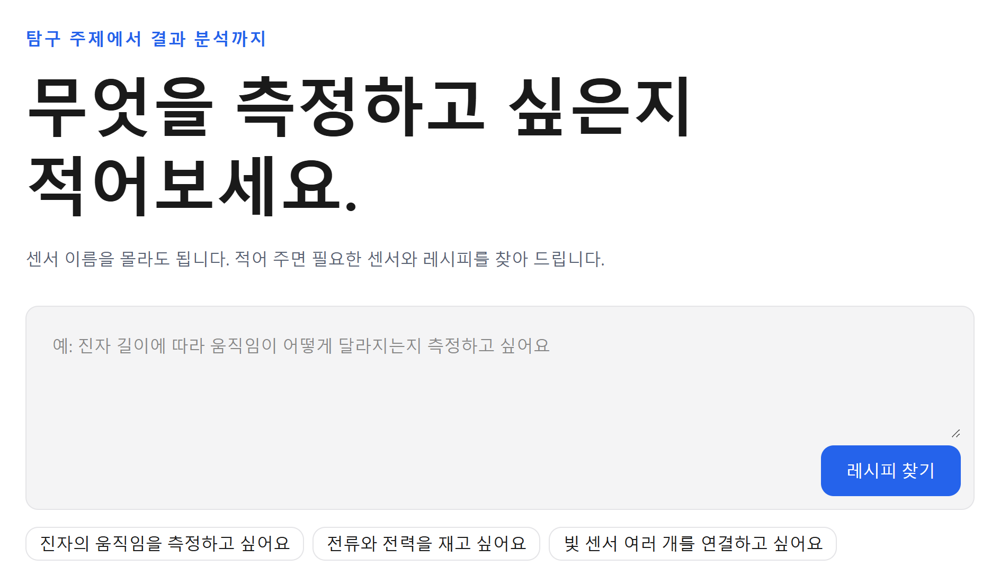

| 화면 | 주소 | 하는 일 |
|---|---|---|
| 아이디어 찾기 | `/` | 탐구 문장으로 센서와 레시피 검색 |
| 레시피 둘러보기 | `/recipes` | 과목·난이도·센서로 거르기 |
| 레시피 상세 | `/recipes/:id` | 준비물, 배선, 코드, 탐구 설계, 측정과 분석 |
| 센서 학습하기 | `/sensors` | 센서 10종의 측정 물리량, 출력 방식, 배선 주의점 |
| 데이터 변환·분석 | `/data-analysis` | 측정값 받기, 요약 통계, 그래프, CSV·PNG 저장 |

지금 공개된 레시피는 3편입니다. 단진자의 주기 측정하기, INA219로 전류 변화 읽기, 주소가 같은 센서 여러 개
연결하기.

## 목차

- [시작하기 전에](#시작하기-전에)
- [1. 측정하고 싶은 것을 적기](#1-측정하고-싶은-것을-적기)
- [2. 센서와 레시피 고르기](#2-센서와-레시피-고르기)
- [3. 레시피 한눈에 보기](#3-레시피-한눈에-보기)
- [4. 준비물 챙기기](#4-준비물-챙기기)
- [5. 배선하기](#5-배선하기)
- [6. 코드 넣기](#6-코드-넣기)
- [7. 탐구 설계](#7-탐구-설계)
- [8. 측정과 분석](#8-측정과-분석)
- [9. 측정값을 표·통계·그래프로](#9-측정값을-표통계그래프로)
- [막혔을 때](#막혔을-때)
- [센서부터 알아보고 싶다면](#센서부터-알아보고-싶다면)
- [선생님께](#선생님께)
- [자주 묻는 질문](#자주-묻는-질문)
- [개발자 문서](#개발자-문서)

## 시작하기 전에

**부품.** 아두이노 우노 R3 보드, USB 케이블(A-B형), 브레드보드, 수-암(MF) 점퍼선, 레시피가 지정하는 센서.
어떤 레시피든 앞의 네 가지는 같고, 센서와 개수만 레시피마다 다릅니다. 실이나 스탠드처럼 전자 부품이 아닌
준비물도 레시피의 준비물 단계에 따로 적혀 있습니다.

**프로그램.** 아두이노 IDE. 설치부터 시리얼 모니터를 여는 법까지는 레시피의 코드 단계에 접어 둔 안내가
있습니다.

**브라우저.** 측정값을 USB로 바로 받으려면 크롬이나 엣지를 쓰세요(Web Serial). 사파리와 파이어폭스에서는
시리얼 모니터 내용을 복사해 붙여넣으면 같은 결과가 나옵니다. 나머지 화면은 브라우저를 가리지 않습니다.

붙여넣은 측정값은 이 브라우저 밖으로 나가지 않습니다. 서버로 올리지 않습니다.

## 1. 측정하고 싶은 것을 적기

첫 화면에 측정하고 싶은 것을 그대로 적습니다. 센서 이름을 몰라도 됩니다. `진자 길이에 따라 움직임이 어떻게
달라지는지 측정하고 싶어요`처럼 적으면 됩니다. 아래 예시 단추를 눌러도 같은 검색이 됩니다.

무엇부터 할지 모르겠으면 세 갈래 중에 고릅니다.

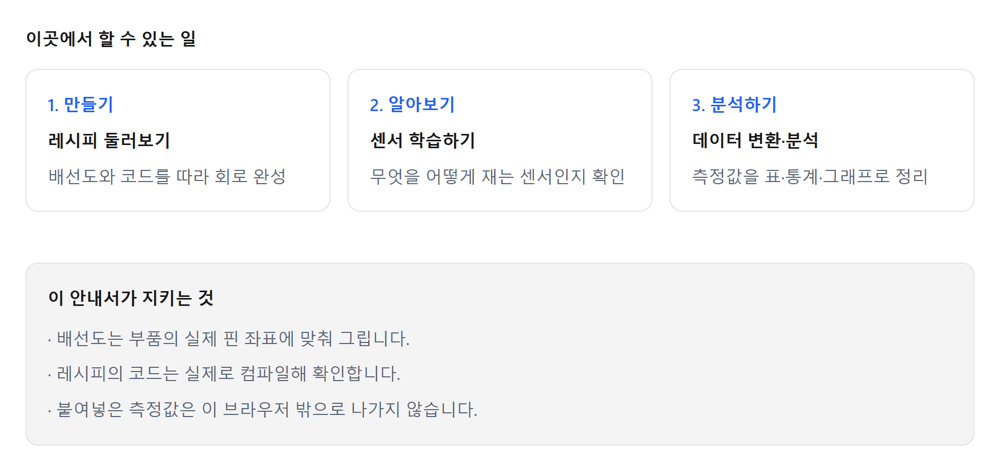

## 2. 센서와 레시피 고르기

검색 결과는 필요한 센서를 먼저 보여 줍니다. 추천 이유에 그 센서가 이 탐구에 맞는 까닭이 적혀 있어, 다른
센서로 바꿔도 되는지 판단할 수 있습니다.

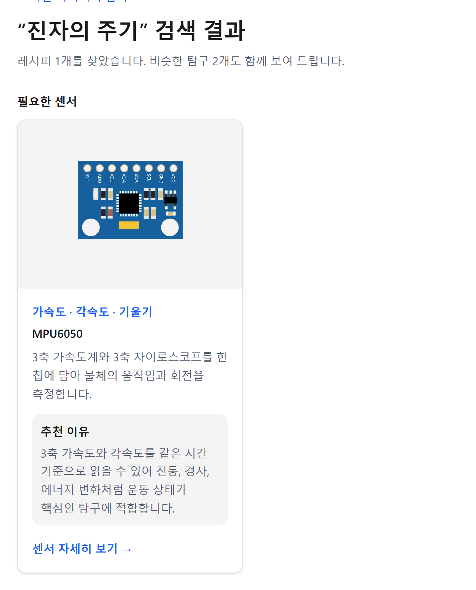

이어서 레시피가 나옵니다. 검색어와 이어진 레시피에는 걸린 키워드가, 곁들여 보여 주는 것에는 `비슷한 탐구`가
붙습니다.

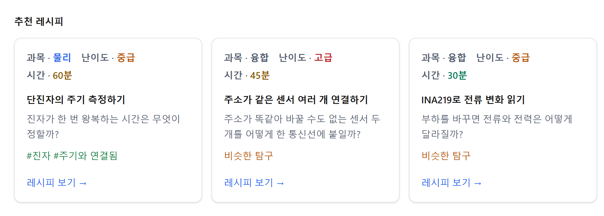

주제가 아직 없으면 목록에서 고릅니다. 과목, 난이도, 센서로 거르고 걸리는 시간순으로 정렬할 수 있습니다.

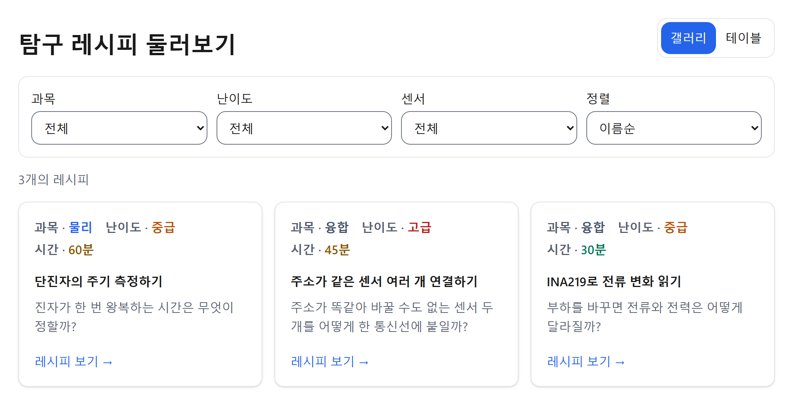

## 3. 레시피 한눈에 보기

레시피를 열면 먼저 이 탐구가 무엇을 묻고 무엇을 바꾸고 무엇을 확인하는지가 표로 나옵니다. 아래 다섯 단계가
손을 대는 순서입니다. 순서를 강제하지는 않으니 아이디어만 보고 갈 수도 있습니다.

`✓ Wokwi에서 실행 확인됨` 표시는 그 레시피의 배선과 코드를 시뮬레이터에서 돌려 값이 나오는 것까지 확인했다는
뜻입니다.

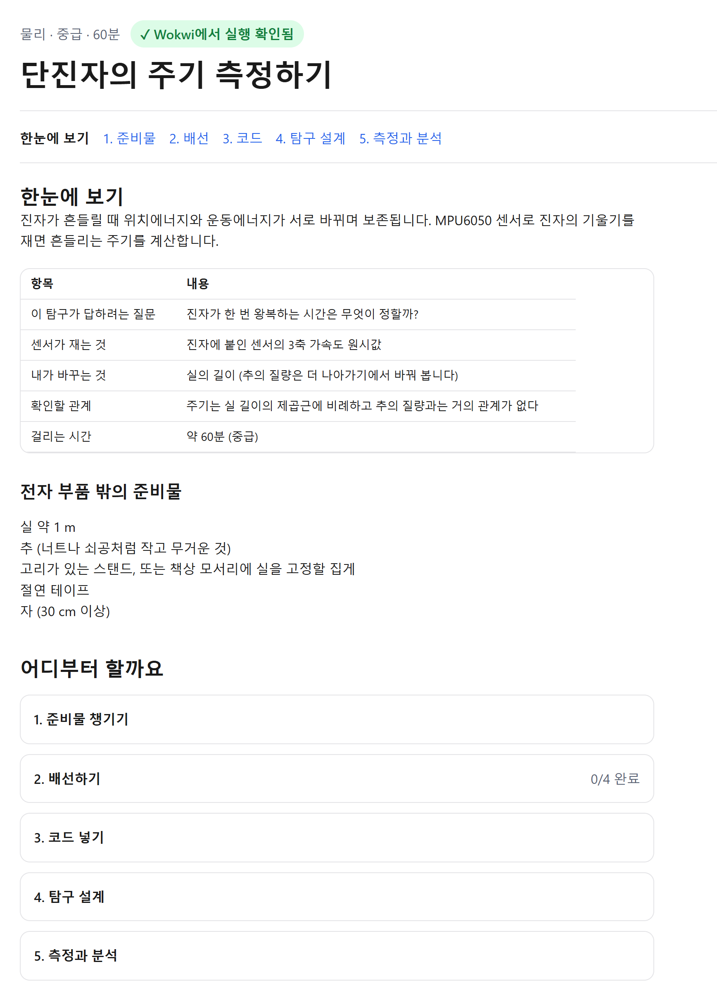

배선 단계에 `0/4 완료`처럼 진행이 적힙니다. 이 표시는 브라우저에 남아, 창을 닫았다 열어도 이어집니다.

## 4. 준비물 챙기기

준비물은 네 묶음으로 나옵니다. 어떤 레시피든 필요한 것, 이 레시피에서 쓰는 부품, 점퍼선, 전자 부품이 아닌
실험 장치. 점퍼선은 종류와 개수까지 적습니다. 양쪽이 뾰족한 수-수(MM)와 한쪽이 구멍인 수-암(MF)은 서로
바꿔 쓸 수 없습니다.

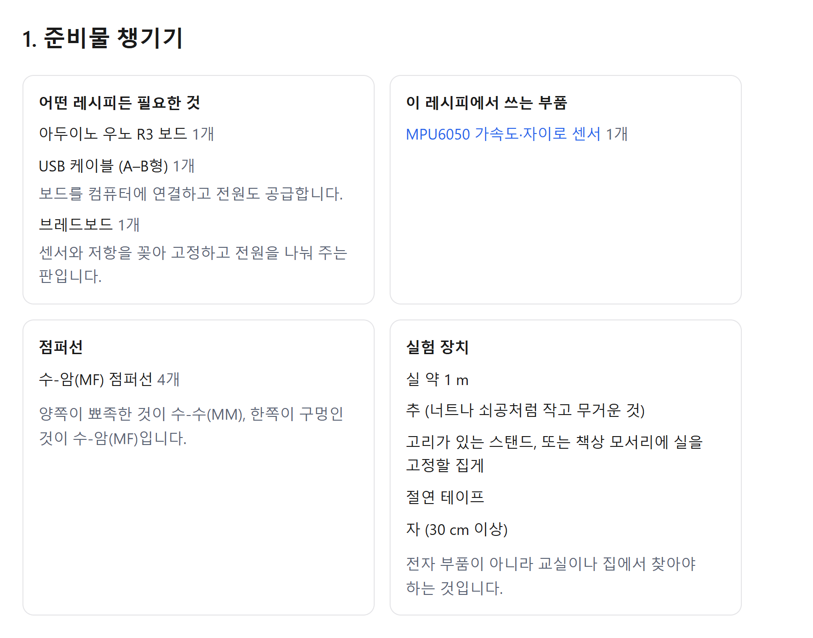

저항을 쓰는 레시피는 저항값 대신 색띠 그림이 나옵니다. 저항에는 값이 인쇄되어 있지 않아 서랍에서 고를 때
색띠로 찾아야 합니다.

## 5. 배선하기

배선도는 부품의 실제 핀 좌표에 맞춰 그립니다. 화면에서 Ctrl과 휠로 500%까지 확대할 수 있습니다. 아래
단계 목록은 한 줄에 하나씩, 어느 핀에서 어느 구멍으로 가는지와 점퍼선 색까지 지정합니다. 지금 단계에 해당하는
선은 배선도에서 강조됩니다.

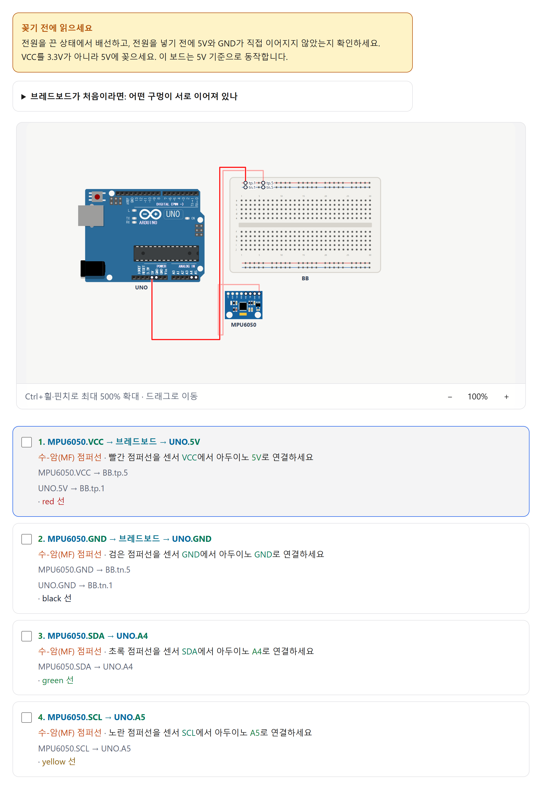

브레드보드의 어떤 구멍이 서로 이어져 있는지는 `브레드보드가 처음이라면`을 펼치면 나옵니다. 한 칸 밀려 꽂아도
화면은 그대로 넘어가므로, 값이 이상할 때 되짚으려면 이 구조를 알아야 합니다.

네 단계를 다 꽂았다고 맞게 꽂은 것은 아닙니다. USB를 꽂기 전에 아래 점검표를 지나가세요. 전원과 GND가
직접 이어져 있으면 보드가 뜨거워집니다.

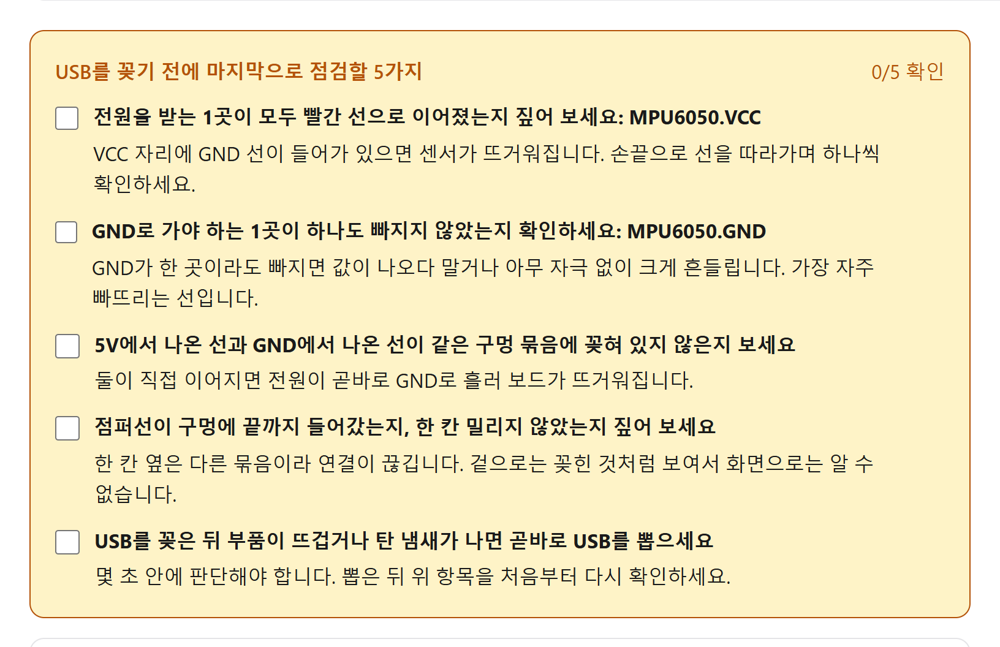

## 6. 코드 넣기

코드를 붙여넣기 전에 `이 코드가 하는 일`을 읽으세요. 켜질 때 한 번 도는 부분과 계속 되풀이되는 부분, 어떤
값이 어떤 순서로 찍히는지가 적혀 있습니다.

스케치에서 노란색으로 칠해진 줄은 값만 바꿔도 안전한 자리입니다. 탐구하면서 바꿔 볼 값이라 표시해 두었습니다.
원래 값이 무엇이었는지도 아래에 적혀 있어 되돌릴 수 있습니다.

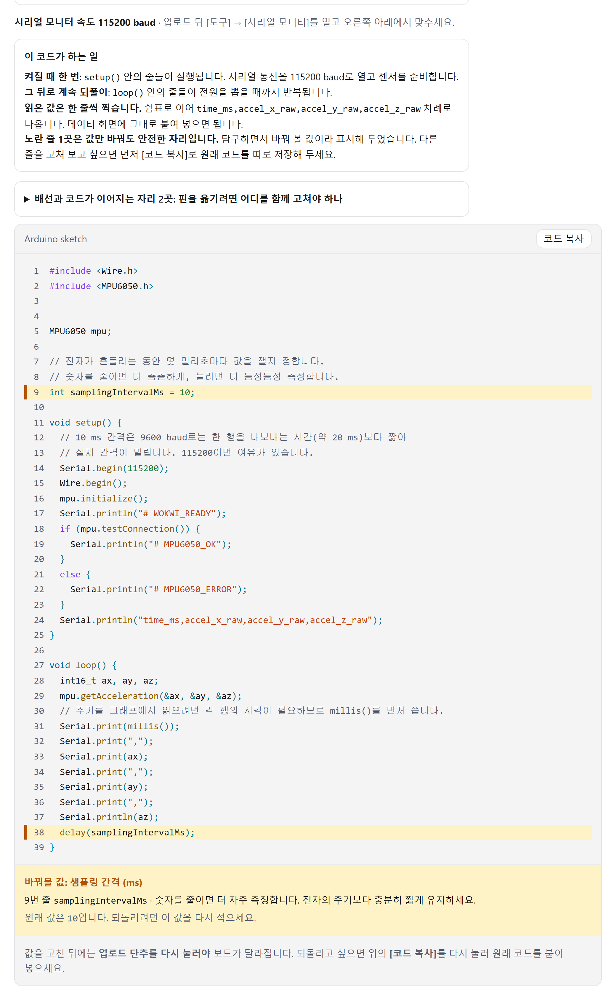

업로드한 뒤 시리얼 모니터에 처음 나온 값이 정상인지 점검표로 확인하세요. `-127.00`이나 `nan`처럼 고장났을
때만 나오는 값을 정상으로 알고 측정을 이어 가면 한 시간이 날아갑니다.

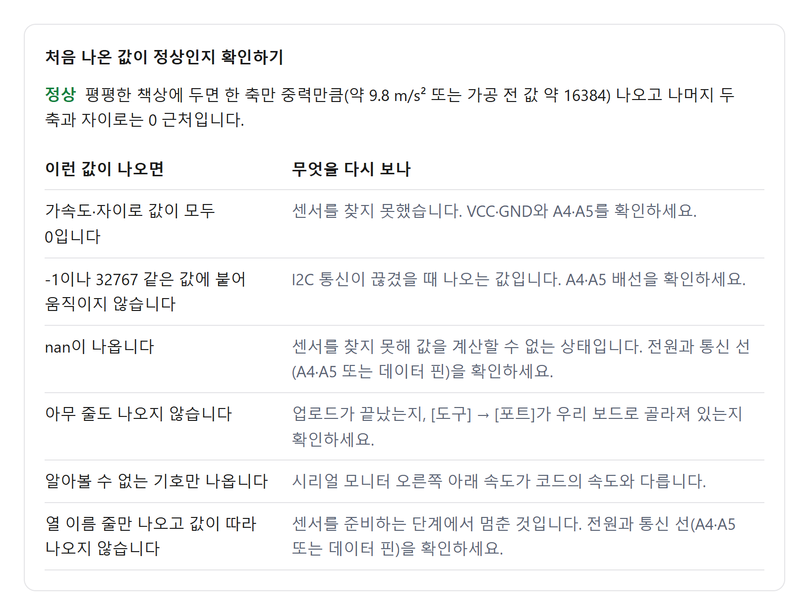

필요한 라이브러리와 시리얼 모니터 속도는 레시피마다 스케치에서 읽어 만듭니다. 화면에 적힌 baud를 시리얼
모니터 오른쪽 아래에서 맞추세요. 속도가 다르면 알아볼 수 없는 기호만 나옵니다.

## 7. 탐구 설계

측정을 시작하기 전에 무엇을 확인하려는지 정합니다. 핵심 식과 기호의 뜻, 단위가 표로 나오고, 측정 전에
예상해 볼 값까지 적혀 있습니다.

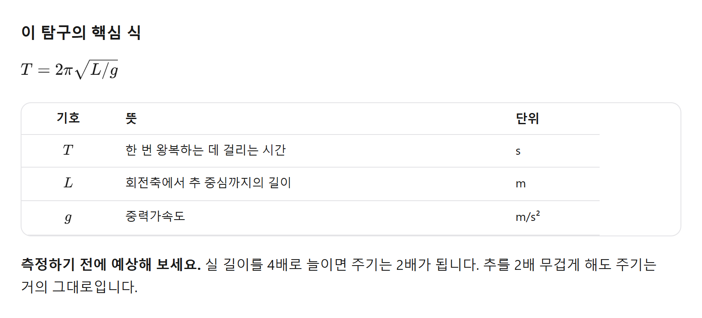

독립 변인, 종속 변인, 통제 변인이 이 탐구에서 무엇인지 지정됩니다. 탐구 순서는 체크 상자라, 어디까지 했는지
표시하며 진행할 수 있습니다.

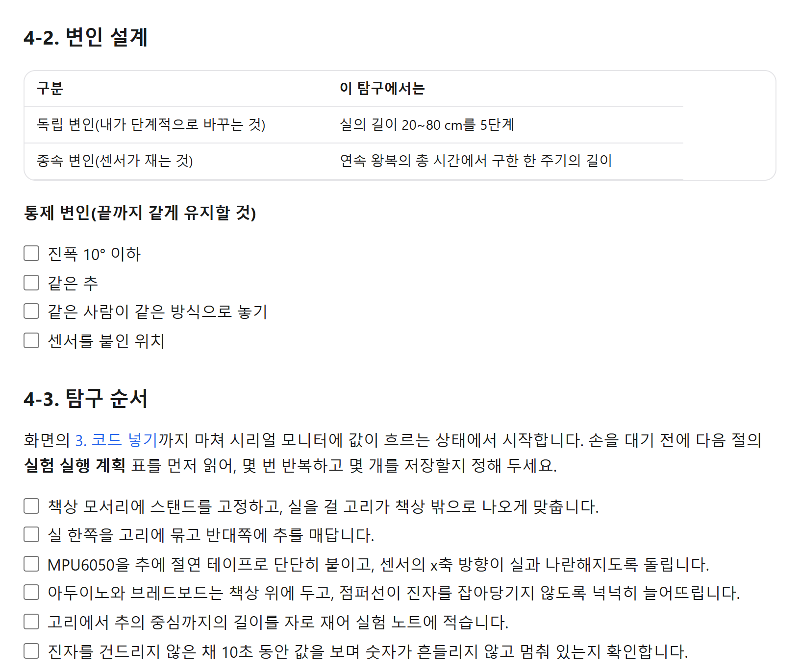

## 8. 측정과 분석

시리얼 모니터에 찍히는 열 이름이 각각 무엇이고 어떤 단위이며 어떻게 쓰는지 표로 나옵니다. 원시값을 그대로
저장해 두면 계산 방법을 바꿔도 다시 측정하지 않아도 됩니다.

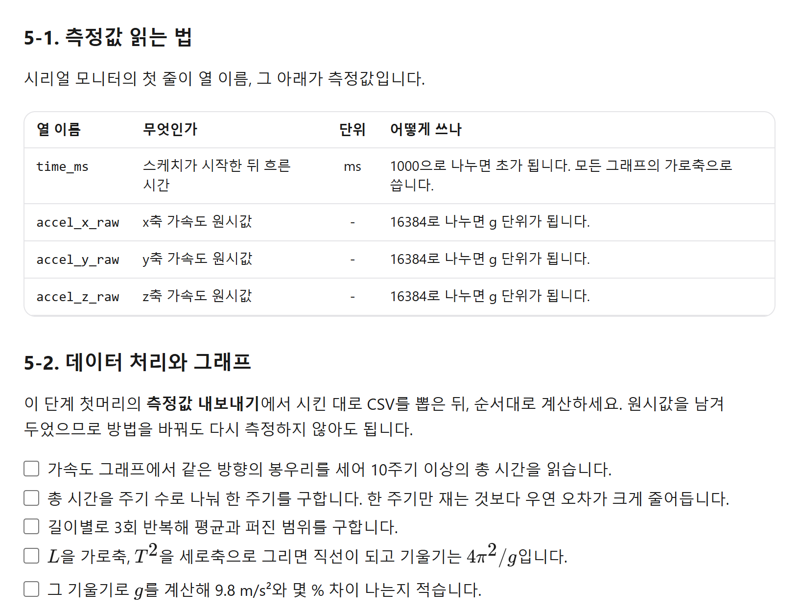

예상과 다른 결과도 자료입니다. 흔한 원인과 확인할 곳이 함께 있습니다.

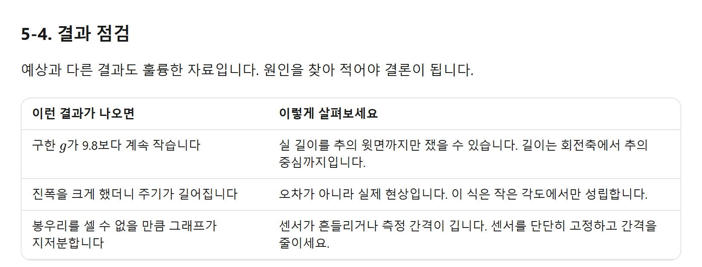

조건을 바꿔 다시 잴 때는 코드의 노란 줄만 고쳐 다시 업로드하고, 데이터 화면에서 `2회차로 추가하기`를
누릅니다. 회차는 브라우저에 남아 레시피와 데이터 화면을 오가도 그대로 있습니다.

## 9. 측정값을 표·통계·그래프로

`데이터 변환·분석` 화면은 두 가지 방법으로 측정값을 받습니다. 아두이노를 꽂은 채 `USB로 받기`를 누르거나,
시리얼 모니터 내용을 복사해 붙여넣습니다. USB로 받을 때는 IDE의 시리얼 모니터 창을 닫아야 합니다. 포트는 한
프로그램만 쓸 수 있습니다.

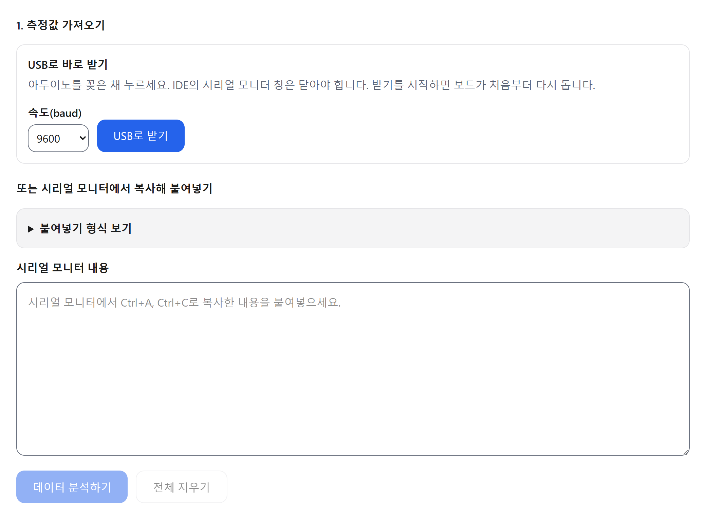

읽어들인 숫자 열마다 개수, 평균, 표준편차, 사분위수, 범위가 나옵니다.

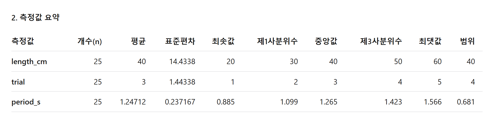

가로축과 세로축을 고르면 그래프가 그려집니다. 회귀직선을 함께 그리면 식과 R²이 그래프 안에 적힙니다. 반복
측정이 있으면 상자그림이나 평균±표준편차 오차막대로 바꿔 그립니다. 완성한 그래프는 PNG로, 표는 CSV로
저장해 보고서에 붙입니다.

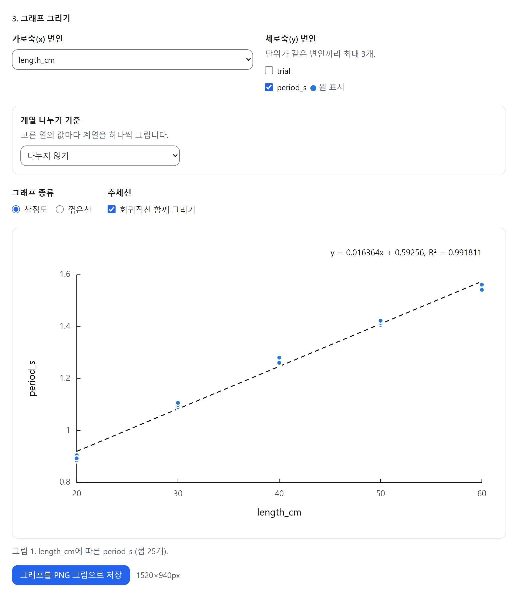

기울기와 상관계수, 설명력은 그래프 아래에 따로 정리됩니다. 인과관계를 뜻하지 않는다는 주의도 함께 나옵니다.

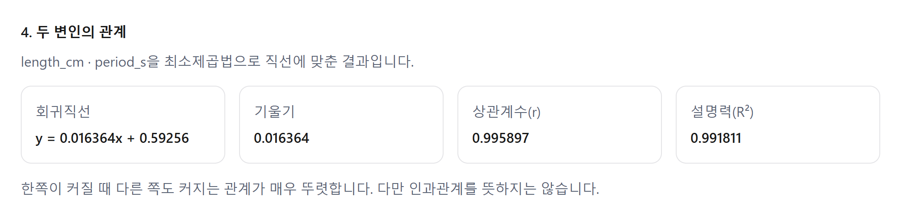

`고급`으로 바꾸면 구간 자르기, 조건 값 열과 계산 열 더하기(로그·삼각함수·차분·누적·이동평균), 계열 나누기와
열로 펼치기, 격자 표를 쓸 수 있습니다.

## 막혔을 때

모든 단계 아래에 문제 해결 목록이 접혀 있습니다. 증상을 고르면 원인과 해결이 나옵니다. 막히는 순간은 어느
단계에서든 오기 때문에, 다른 화면으로 보내지 않고 그 자리에 둡니다.

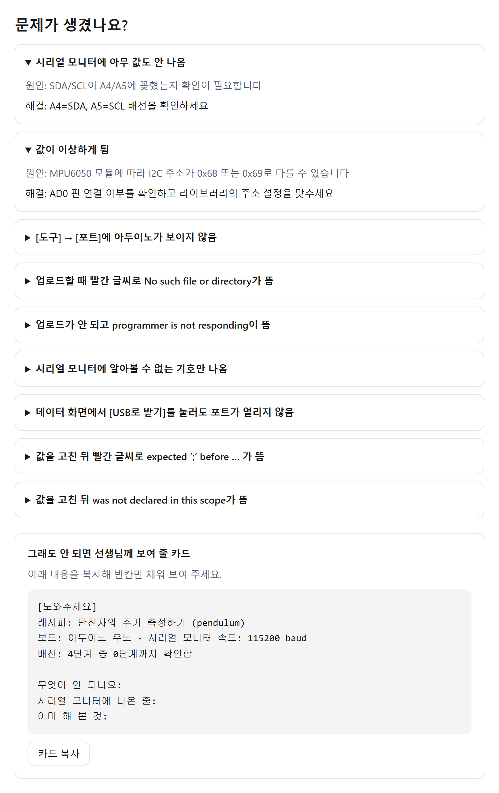

그래도 안 되면 맨 아래 도움 요청 카드를 복사해 선생님께 보여 주세요. 레시피 이름, 보드, 시리얼 모니터 속도,
배선을 어디까지 확인했는지가 이미 채워져 있습니다. "안 돼요"라는 말만으로는 선생님도 처음부터 다시
짚어야 합니다.

## 센서부터 알아보고 싶다면

`센서 학습하기`에는 이 안내서가 쓰는 센서와 버스 부품 10종이 있습니다. 측정하는 물리량과 출력
인터페이스(I2C, 아날로그, 디지털, 1-Wire)로 거를 수 있습니다.

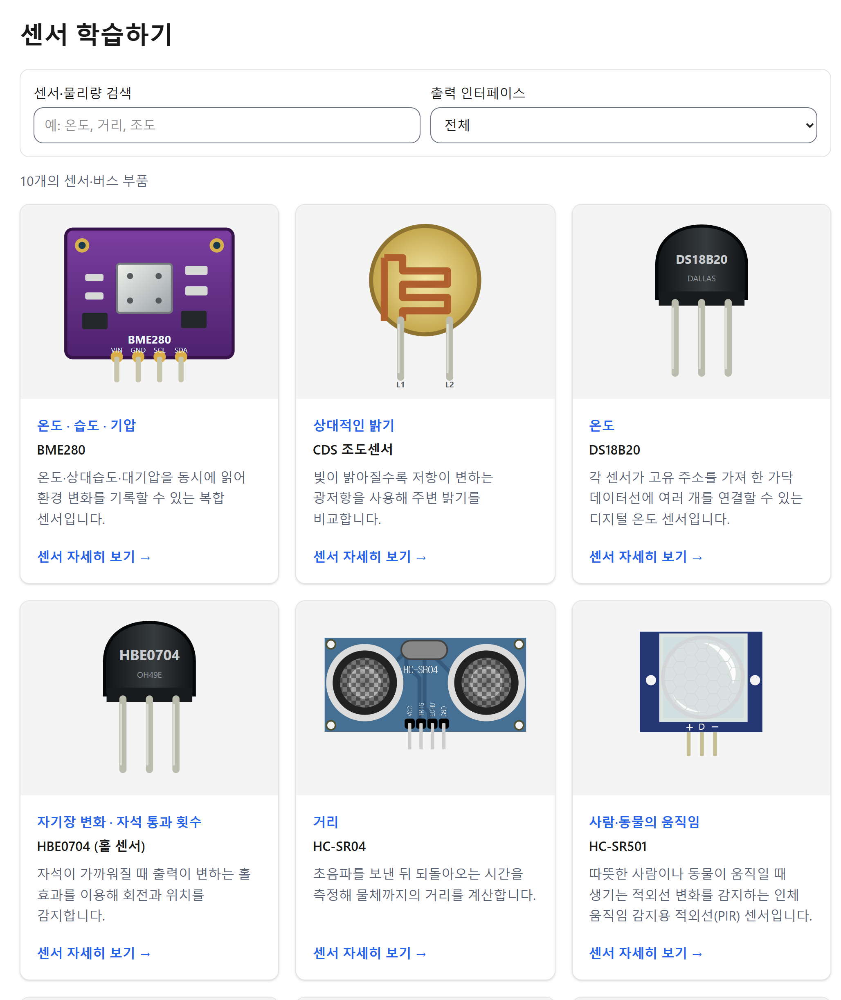

센서를 열면 스펙과 핀 구성, 추천 실험, 사용할 때 확인할 점이 나옵니다. 아래에는 그 센서를 쓰는 레시피가
이어집니다.

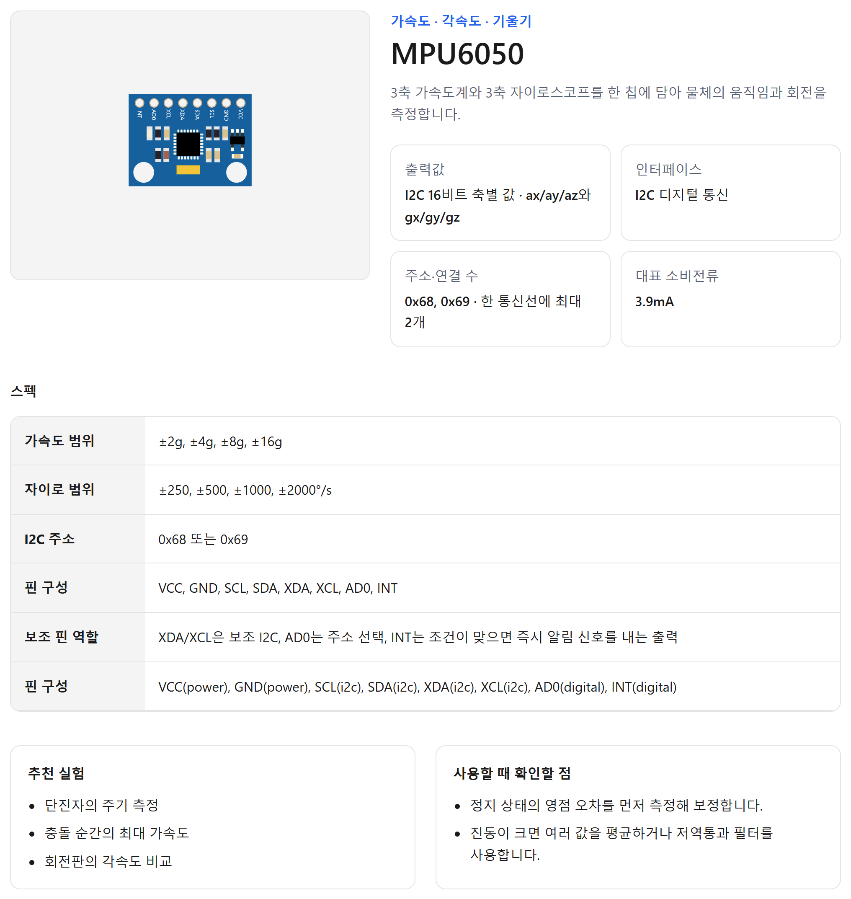

## 선생님께

- 수업 전에 확인할 것은 준비물 단계입니다. 레시피마다 점퍼선 종류와 개수까지 적혀 있어 그대로 담으면 됩니다.
- 학생이 막히면 도움 요청 카드를 받으세요. 보드와 통신 속도, 배선 진행이 채워져 있어 물어볼 것이 줄어듭니다.
- 배선 진행과 측정 회차는 학생의 브라우저에 남습니다. 같은 기기에서 이어서 하면 처음부터 다시 하지 않습니다.
- 측정값은 서버로 가지 않습니다. 학생이 붙여넣은 자료는 그 브라우저 안에서만 처리됩니다.

## 자주 묻는 질문

**USB로 받기를 눌러도 포트가 열리지 않습니다.** 아두이노 IDE의 시리얼 모니터 창을 닫으세요. 포트는 한
프로그램만 쓸 수 있습니다. 크롬이나 엣지가 아니면 이 단추 대신 붙여넣기를 쓰세요.

**시리얼 모니터에 알아볼 수 없는 기호만 나옵니다.** 시리얼 모니터의 속도가 스케치와 다릅니다. 코드 단계에
적힌 baud로 맞추세요.

**값이 이상하게 튑니다.** 코드 단계의 처음 나온 값 점검표와 배선 단계의 점검표를 지나가세요. I2C 센서는
SDA와 SCL이 A4, A5에 꽂혔는지부터 확인합니다.

**다른 센서로 바꿔도 되나요.** 검색 결과의 추천 이유와 센서 상세의 스펙을 견줘 보세요. 핀과 라이브러리가
바뀌면 배선 단계와 스케치의 핀 선언을 함께 고쳐야 합니다. 그 두 자리는 코드 단계의 `배선과 코드가 이어지는
자리`에 표로 있습니다.

**측정 자료가 서버로 올라가나요.** 올라가지 않습니다. 붙여넣거나 USB로 받은 값은 브라우저 안에서만
처리하고, CSV와 PNG도 브라우저에서 만듭니다.

## 이 안내서가 지키는 것

- 배선도는 부품의 실제 핀 좌표에 맞춰 그립니다.
- 레시피의 코드는 실제로 컴파일해 확인합니다.
- 붙여넣은 측정값은 브라우저 밖으로 나가지 않습니다.

## 개발자 문서

빌드, 테스트, 콘텐츠 검증, 배포는 [`docs/development.md`](docs/development.md)에 있습니다.

- 요구사항 명세: [`.omc/specs/deep-interview-how-to-use-arduino.md`](.omc/specs/deep-interview-how-to-use-arduino.md)
- 구현 계획: [`.omc/plans/how-to-use-arduino-implementation.md`](.omc/plans/how-to-use-arduino-implementation.md)
- 한국어 문구 규칙: [`docs/korean-copy-rules.md`](docs/korean-copy-rules.md)
- Firebase 프로젝트 준비: [`docs/firebase-setup.md`](docs/firebase-setup.md)
- Wokwi 시뮬레이션 준비: [`docs/wokwi-setup.md`](docs/wokwi-setup.md)
